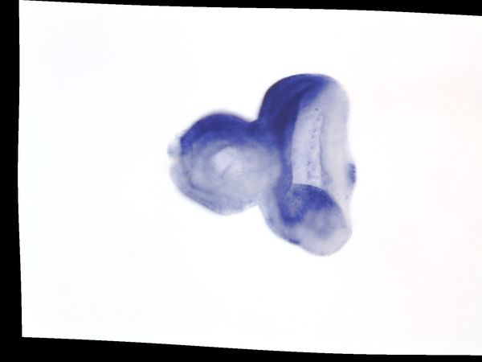
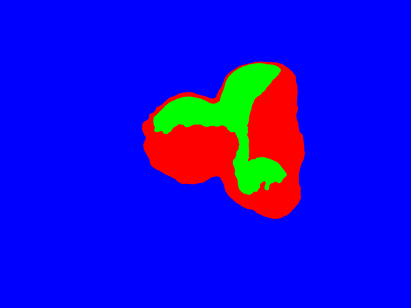
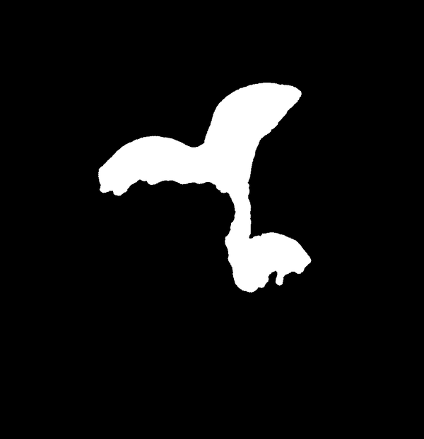
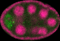
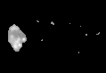
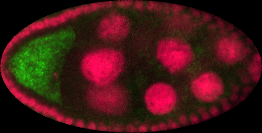
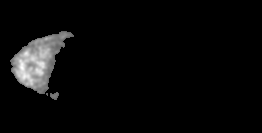

# Binary Pattern Dictionary Learning

[](https://travis-ci.com/Borda/pyBPDL)
[](https://codecov.io/gh/Borda/pyBPDL)
[](https://www.codacy.com?utm_source=github.com&amp;utm_medium=referral&amp;utm_content=Borda/pyBPDL&amp;utm_campaign=Badge_Grade)
[](https://app.shippable.com/github/Borda/pyBPDL)
[](https://app.shippable.com/github/Borda/pyBPDL)
[](https://circleci.com/gh/Borda/pyBPDL)

We present an final step of image processing pipeline which accepts a large number of images, containing spatial expression information for thousands of genes in Drosophila imaginal discs. We assume that the gene activations are binary and can be expressed as a union of a small set of non-overlapping spatial patterns, yielding a compact representation of the spatial activation of each gene. This lends itself well to further automatic analysis, with the hope of discovering new biological relationships. Traditionally, the images were labeled manually, which was very time consuming. The key part of our work is a binary pattern dictionary learning algorithm, that takes a set of binary images and determines a set of patterns, which can be used to represent the input images with a small error.


For the image segmentation and individual object detection we used [Image segmentation toolbox](https://borda.github.io/pyImSegm/).

## Comparable (SoA) Methods

We have our method BPDL and also we compare it to State-of-the-Art, see [Faces dataset decompositions](http://scikit-learn.org/stable/auto_examples/decomposition/plot_faces_decomposition.html#example-decomposition-plot-faces-decomposition-py):
 
 * [**Fast ICA**](notebooks/method_FastICA.ipynb), derived from [sklearn.decomposition.FastICA](http://scikit-learn.org/stable/modules/generated/sklearn.decomposition.FastICA.html)
 * [**Sparse PCA**](notebooks/method_SparsePCA.ipynb), derived from [sklearn.decomposition.SparsePCA](http://scikit-learn.org/stable/modules/generated/sklearn.decomposition.SparsePCA.html)
 * [**Non-negative Matrix Factorisation**](notebooks/method_NMF.ipynb), derived from [sklearn.decomposition.NMF](http://scikit-learn.org/stable/modules/generated/sklearn.decomposition.NMF.html)
 * [**Dictionary Learning**](notebooks/method_DictiLearn.ipynb) with Matching pursuit, derived from [sklearn.decomposition.DictionaryLearning](http://scikit-learn.org/stable/modules/generated/sklearn.decomposition.DictionaryLearning.html)
 * our [**Binary Pattern Dictionary Learning**](notebooks/method_BPDL.ipynb)

---

## Installation and configuration

**Configure local environment**

Create your own local environment, for more see the [User Guide](https://pip.pypa.io/en/latest/user_guide.html), and install dependencies requirements.txt contains list of packages and can be installed as
```bash
@duda:~$ cd pyImSegm  
@duda:~/pyBPDL virtualenv env
@duda:~/pyBPDL source env/bin/activate  
(env)@duda:~/pyBPDL pip install -r requirements.txt  
(env)@duda:~/pyBPDL python ...
```
and in the end terminating...
```bash
(env)@duda:~/pyBPDL deactivate
```

**Installation**

The package can be installed via pip from the folder
```bash
python setup.py install
```

---

## Data

We work on synthetic and also real images

### Synthetic datasets
 
We have script `run_dataset_generate.py` which generate dataset with given configuration. The images subsets are:
  
  1. **pure** images meaning they are generated just from the atlas
  2. **noise** images from (1) with added binary noise
  3. **deform** images from (1) with applyed small elastic deformation
  4. **deform&noise** images from (3) with added binary noise
  
both for binary and probabilistic images.  
Some parameters like number of patterns and image size (2D or 3D) are parameters passed to the script
Other parameters like noise and deformation ratio are specified in the script.
  
```bash
python experiments/run_dataset_generate.py \
    -p ~/DATA/apdDataset_vX \
    --nb_samples 600 --nb_patterns 9 --image_size 128 128
```

For adding Gaussian noise with given sigmas use following script:
  
```bash
python experiments/run_dataset_add_noise.py \
    -p ~/Medical-drosophila/synthetic_data \
    -d apdDataset_vX --sigmas 0.01 0.1 0.2

```
 
### Real images

We can use as input images either binary segmentation or fuzzy values.
For the activation extraction we used [pyImSegm](https://github.com/Borda/pyImSegm) package.

**Drosophila imaginal discs**

For extracting gene activations we used unsupervised segmentation because the colour appearing variate among images so we segment the gene in each image indipendetly.

<!-- 

 
 
-->

To cut the set of images to the minimal size with reasonable infomation (basicaly removing bacround starting from image boundaries) you can use following scirpt

```bash
python experiments/run_cut_minimal_images.py \
    -in "images/imaginal_discs/gene/*.png" \
    -out images/imaginal_discs/gene_cut -thr 0.001
```


**Drosophila ovary**

Here the gene activation is presented in separate channel - green. so we just take this information and normalise it. Further we assume that this activation is fuzzy based on intensities on the green channel.

```bash
python experiments/run_extract_fuzzy_activation.py \
    -in "images/ovary_stage-2/image/*.png" -out images/ovary_stage-2/gene
```

Ovary in development stage 2




Ovary in development stage 3





---

## Experiments

We run experiment for debugging and also evaluating performances.
To collect the results we use `run_parse_experiments_result.py` which visit all experiments and aggregate the configurations with results together into one large CSV file

```bash
python run_parse_experiments_result.py \
    -p ~/Medical-drosophila/TEMPORARY/experiments_APDL_synth \
    --fname_results results.csv --func_stat mean
```

### Binary Pattern Dictionary Learning

We run just our method on both synthetic/real images using `run_experiment_apd_bpdl.py` where each configuration have several runs in debug mode 
 (saving more log information and also exporting all partial estimated atlases)
 
 1. **Synthetic datasets**
```bash
python run_experiments_bpdl.py \
    -in data/atomicPatternDictionary_v0 \
    -out results
```
 2. **Real images - drosophila**
```bash
python run_experiments_bpdl.py --type real \
    -in ~/Medical-drosophila/TEMPORARY/type_1_segm_reg_binary \
    -out ~/Medical-drosophila/TEMPORARY/experiments_APDL_real \
    --dataset gene_small
```

### All methods

We cun all methods in the equal configuration mode on given synthetic/real data using `run_experiments_all.py` running in info mode, just a few printing
 
 1. **Synthetic datasets**
```bash
python run_experiments_all.py \
    -in ~/Medical-drosophila/synthetic_data/atomicPatternDictionary_v1 \
    -out ~/Medical-drosophila/TEMPORARY/experiments_APDL_synth1 \
    --method DL NMF
```
 2. **Real images - drosophila**
```bash
python run_experiments_all.py --type real \
    -in ~/Medical-drosophila/TEMPORARY/type_1_segm_reg_binary \
    -out ~/Medical-drosophila/TEMPORARY/experiments_APD_real \
    --dataset gene_small
```


### Aggregating results

The result from multiple experiments can be simpli aggregatid into sigle CVS file

```bash
python experiments/run_parse_experiments_results.py \
    --path results --name_results results.csv --name_config config.json --func_stat none
```

In case you need add of change a evaluation you do not need to retun all experiment since the alases and encoding is done, you can just rerun the elevation phase generating new results `results_NEW.csv` and parsing the new results

```bash
python experiments/run_recompute_experiments_result.py -p results

python experiments/run_parse_experiments_results.py \
    --path results --name_results results_NEW.csv --name_config config.json --func_stat none
```

---

## References

For complete references see [bibtex](docs/references.bib).
1. Borovec J., Kybic J. (2016) **Binary Pattern Dictionary Learning for Gene Expression Representation in Drosophila Imaginal Discs.** In: Computer Vision – ACCV 2016 Workshops. Lecture Notes in Computer Science, vol 10117, Springer, [DOI: 10.1007/978-3-319-54427-4_40](http://doi.org/10.1007/978-3-319-54427-4_40).
