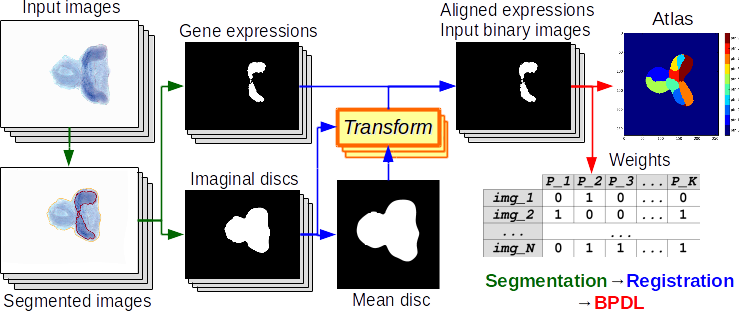
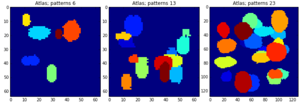
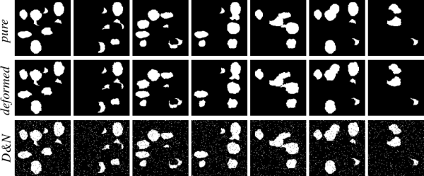
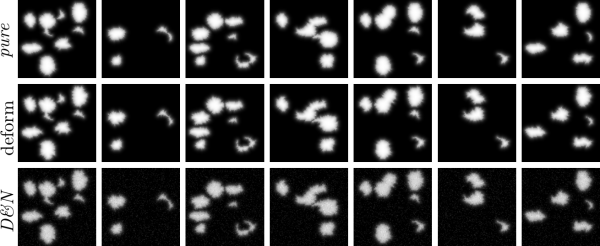
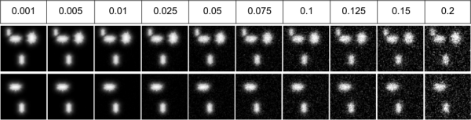
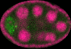
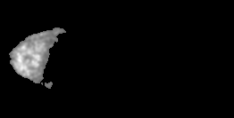
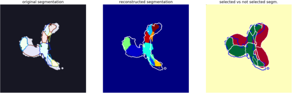

# Binary Pattern Dictionary Learning

[](https://github.com/Borda/pyBPDL/actions/workflows/ci-testing.yml)
[](https://codecov.io/gh/Borda/pyBPDL)
[](https://github.com/Borda/pyBPDL/actions/workflows/ci-experiment.yml)

[](https://github.com/Borda/pyBPDL/actions/workflows/code-format.yml)
[](https://www.codacy.com/app/Borda/pyBPDL?utm_source=github.com&amp;utm_medium=referral&amp;utm_content=Borda/pyBPDL&amp;utm_campaign=Badge_Grade)
[](https://www.codefactor.io/repository/github/borda/pybpdl)
[](https://pybpdl.readthedocs.io/en/latest/?badge=latest)
[](https://gitter.im/pyBPDL/community?utm_source=badge&utm_medium=badge&utm_campaign=pr-badge)
<!--
[](https://app.shippable.com/github/Borda/pyBPDL)
[](https://app.shippable.com/github/Borda/pyBPDL)
-->

We present a final step of image processing pipeline which accepts a large number of images, containing spatial expression information for thousands of genes in Drosophila imaginal discs. We assume that the gene activations are binary and can be expressed as a union of a small set of non-overlapping spatial patterns, yielding a compact representation of the spatial activation of each gene. This lends itself well to further automatic analysis, with the hope of discovering new biological relationships. Traditionally, the images were labelled manually, which was very time-consuming. The key part of our work is a binary pattern dictionary learning algorithm, that takes a set of binary images and determines a set of patterns, which can be used to represent the input images with a small error.



For the image segmentation and individual object detection, we used [Image segmentation toolbox](https://borda.github.io/pyImSegm/).

## Comparable (SoA) methods

We have our method BPDL and also we compare it to State-of-the-Art, see [Faces dataset decompositions](http://scikit-learn.org/stable/auto_examples/decomposition/plot_faces_decomposition.html#example-decomposition-plot-faces-decomposition-py):
 
* [**Fast ICA**](notebooks/method_FastICA.ipynb), derived from [sklearn.decomposition.FastICA](http://scikit-learn.org/stable/modules/generated/sklearn.decomposition.FastICA.html)
* [**Sparse PCA**](notebooks/method_SparsePCA.ipynb), derived from [sklearn.decomposition.SparsePCA](http://scikit-learn.org/stable/modules/generated/sklearn.decomposition.SparsePCA.html)
* [**Non-negative Matrix Factorisation**](notebooks/method_NMF.ipynb), derived from [sklearn.decomposition.NMF](http://scikit-learn.org/stable/modules/generated/sklearn.decomposition.NMF.html)
* [**Dictionary Learning**](notebooks/method_DictiLearn.ipynb) with Matching pursuit, derived from [sklearn.decomposition.DictionaryLearning](http://scikit-learn.org/stable/modules/generated/sklearn.decomposition.DictionaryLearning.html)
* [**Spectral Clustering**](notebooks/method_SpectralClust.ipynb) used in [SPEX2](https://www.ncbi.nlm.nih.gov/pmc/articles/PMC2881357/), derived from [sklearn.cluster.SpectralClustering](http://scikit-learn.org/stable/modules/generated/sklearn.cluster.SpectralClustering.html)
* [**CanIca & MSDL**](notebooks/method_MSDL-CanICA.ipynb) used for observing spatial activation in fMRI, derived from [nilearn.decomposition.CanICA](http://nilearn.github.io/modules/generated/nilearn.decomposition.CanICA.html) and  [nilearn.decomposition.DictLearning](http://nilearn.github.io/modules/generated/nilearn.decomposition.DictLearning.html)
* our [**Binary Pattern Dictionary Learning**](notebooks/method_BPDL.ipynb)

---

## Installation and configuration

### Configure local environment

Create your local environment, for more see the [User Guide](https://pip.pypa.io/en/latest/user_guide.html), and install dependencies requirements.txt contains a list of packages and can be installed as
```bash
@duda:~$ cd pyBPDL  
@duda:~/pyBPDL$ virtualenv env
@duda:~/pyBPDL$ source env/bin/activate  
(env)@duda:~/pyBPDL$ pip install -r requirements.txt  
(env)@duda:~/pyBPDL$ python ...
```
moreover, in the end, terminating...
```bash
(env)@duda:~/pyBPDL$ deactivate
```

### Installation

The package can be installed via pip 
```bash
pip install git+https://github.com/Borda/pyBPDL.git
```
alternatively, using `setuptools` from a local folder 
```bash
python setup.py install
```

---

## Data

We work on synthetic and also real images.

### Synthetic datasets
 
We have script `run_dataset_generate.py` which generate a dataset with the given configuration. The images subsets are:
  
1. **pure** images meaning they are generated just from the atlas
2. **noise** images from (1) with added binary noise
3. **deform** images from (1) with applied small elastic deformation
4. **deform&noise** images from (3) with added binary noise
  
both for binary and fuzzy images.  
Some parameters like number of patterns and image size (2D or 3D) are parameters passed to the script
Other parameters like noise and deformation ratio, are specified in the script.
  
```bash
python experiments/run_dataset_generate.py \
    -p ~/DATA/apdDataset_vX \
    --nb_samples 600 --nb_patterns 9 --image_size 128 128
```

**Sample atlases**


**Sample binary images**


**Sample fuzzy images**


For adding Gaussian noise with given sigmas use following script:
```bash
python experiments/run_dataset_add_noise.py \
    -p ~/Medical-drosophila/synthetic_data \
    -d apdDataset_vX --sigma 0.01 0.1 0.2
```


 
### Real images

We can use as input images, either binary segmentation or fuzzy values.
For the activation extraction we used [pyImSegm](https://github.com/Borda/pyImSegm) package.

#### Drosophila imaginal discs

For extracting gene activations, we used unsupervised segmentation because the colour is appearing variate among images, so we segment the gene in each image independently.

<!-- 

 
 
-->

To cut the set of images to the minimal size with reasonable information (basically removing background starting from image boundaries) you can use the following script

```bash
python experiments/run_cut_minimal_images.py \
    -i "./data_images/imaginal_discs/gene/*.png" \
    -o ./data_images/imaginal_discs/gene_cut -t 0.001
```

#### Drosophila ovary

Here the gene activation is presented in the separate channel - green. So we just take this information and normalise it. Further, we assume that this activation is fuzzy based on intensities on the green channel.

```bash
python experiments/run_extract_fuzzy_activation.py \
    -i "./data_images/ovary_stage-2/image/*.png" \
    -o ./data_images/ovary_stage-2/gene
```

Ovary in development stage 2




Ovary in development stage 3




---

## Experiments

We run an experiment for debugging and also evaluating performances.
To collect the results we use `run_parse_experiments_result.py` which visit all experiments and aggregate the configurations with results together into one large CSV file.

```bash
python run_parse_experiments_result.py \
    -i ~/Medical-drosophila/TEMPORARY/experiments_APDL_synth \
    --fname_results results.csv --func_stat mean
```

### Binary Pattern Dictionary Learning

We run just our method on both synthetic/real images using `run_experiment_apd_bpdl.py` where each configuration have several runs in debug mode 
 (saving more log information and also exporting all partially estimated atlases)
 
1. **Synthetic datasets**
    ```bash
    python experiments/run_experiments.py \
        --type synth --method BPDL \
        -i ./data_images/syntheticDataset_vX \
        -o ./results -c ./data_images/sample_config.yml \
        --debug
    ```
2. **Real images - drosophila**
    ```bash
    python experiments/run_experiments.py \
        --type real --method BPDL  \
        -i ~/Medical-drosophila/TEMPORARY/type_1_segm_reg_binary \
        -o ~/Medical-drosophila/TEMPORARY/experiments_APDL_real \
        --dataset gene_small
    ```

Using configuration YAML file `-cfg` we can set several parameters without changing the code and parametrise experiments such way that we can integrate over several configurations. While a parameter is a list it is aromatically iterated, and you set several iterations, then it runs as each to each option, for instance
```yaml
nb_labels: [5, 10]
init_tp: 'random'
connect_diag: true
overlap_major: true
gc_reinit: true
ptn_compact: false
ptn_split: false
gc_regul: 0.000000001
tol: 0.001
max_iter: 25
runs: 1
deform_coef: [null, 0.0, 1.0, 0.5]
```
will run 2 * 4 = 8 experiment - two numbers of patterns and four deformation coefficients.

### All methods

We can run all methods in the equal configuration mode on given synthetic/real data using `run_experiments_all.py` running in info mode, just a few printing
 
1. **Synthetic datasets**
    ```bash
    python experiments/run_experiments.py \
        -i ~/Medical-drosophila/synthetic_data/atomicPatternDictionary_v1 \
        -o ~/Medical-drosophila/TEMPORARY/experiments_APDL_synth1 \
        --method PCA ICA DL NMF BPDL
    ```
2. **Real images - drosophila**
    ```bash
    python experiments/run_experiments.py --type real \
        -i ~/Medical-drosophila/TEMPORARY/type_1_segm_reg_binary \
        -o ~/Medical-drosophila/TEMPORARY/experiments_APD_real \
        --dataset gene_small
    ```

## Visualisations

Since we have a result in the form of estimated atlas and encoding (binary weights) for each image, we can simply see the back reconstruction
```bash
python experiments/run_reconstruction.py \
    -e ./results/ExperimentBPDL_real_imaginal_disc_gene_small \
    --nb_workers 1 --visual
```



### Aggregating results

The result from multiple experiments can be simple aggregated into single CVS file

```bash
python experiments/run_parse_experiments_results.py \
    --path ./results --name_results results.csv  \
    --name_config config.yaml --func_stat none
```

In case you need to add or change an evaluation you do not need to return all experiment since the aliases and encoding is done, you can just rerun the elevation phase generating new results `results_NEW.csv`

```bash
python experiments/run_recompute_experiments_result.py -i ./results
```
 and parsing the new results
```bash
python experiments/run_parse_experiments_results.py \
    --path ./results --name_results results_NEW.csv  \
    --name_config config.yaml --func_stat none
```

---

## References

For complete references see [bibtex](docs/references.bib).
1. Borovec J., Kybic J. (2016) **Binary Pattern Dictionary Learning for Gene Expression Representation in Drosophila Imaginal Discs.** In: Computer Vision – ACCV 2016 Workshops. Lecture Notes in Computer Science, vol 10117, Springer, [DOI: 10.1007/978-3-319-54427-4_40](http://doi.org/10.1007/978-3-319-54427-4_40).
