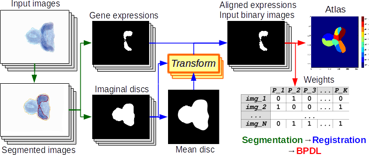

# Binary Pattern Dictionary Learning

[](https://travis-ci.com/Borda/pyBPDL)
[](https://app.shippable.com/github/Borda/pyBPDL)
[](https://app.shippable.com/github/Borda/pyBPDL)
[](https://codecov.io/gh/Borda/pyBPDL)
[](https://circleci.com/gh/Borda/pyBPDL)

We present an final step of image processing pipeline which accepts a large number of images, containing spatial expression information for thousands of genes in Drosophila imaginal discs. We assume that the gene activations are binary and can be expressed as a union of a small set of non-overlapping spatial patterns, yielding a compact representation of the spatial activation of each gene. This lends itself well to further automatic analysis, with the hope of discovering new biological relationships. Traditionally, the images were labeled manually, which was very time consuming. The key part of our work is a binary pattern dictionary learning algorithm, that takes a set of binary images and determines a set of patterns, which can be used to represent the input images with a small error.




# Comparable (SoA) Methods

We have our method BPDL and also we comapre it to state-of-the-art, see [Faces dataset decompositions](http://scikit-learn.org/stable/auto_examples/decomposition/plot_faces_decomposition.html#example-decomposition-plot-faces-decomposition-py):
 
 * **FastICA**, [sklearn.decomposition.FastICA](http://scikit-learn.org/stable/modules/generated/sklearn.decomposition.FastICA.html)
 * **SparsePCA**, [sklearn.decomposition.SparsePCA](http://scikit-learn.org/stable/modules/generated/sklearn.decomposition.SparsePCA.html)
 * **Non-negative Matrix Factorisation**, [sklearn.decomposition.NMF](http://scikit-learn.org/stable/modules/generated/sklearn.decomposition.NMF.html)
 * **Dictionary Learning** with Matching pursuit, [sklearn.decomposition.DictionaryLearning](http://scikit-learn.org/stable/modules/generated/sklearn.decomposition.DictionaryLearning.html)
 * our **Binary Pattern Dictionary Learning**

# Data

We work on synthetic and also real images

## Synthetic datasets
 
We have script **run_generate_dataset.py** which generate dataset with given configuration. The images subsets are:
  
  1. **pure** images meaning they are generated just from the atlas
  2. **noise** images from (1) with added binary noise
  3. **deform** images from (1) with applyed small elastic deformation
  4. **deform&noise** images from (3) with added binary noise
  
Some parameters like noise and deformation ratio are specified in the script.
Some other parameters like number of patterns and image size (2D or 3D) are parameters passed to the script
  
The location is **./data**
 
## Real images - drosophila

We can use as input images either binary segmentation or probabilistic values

# Experiments

We run experiment for debugging and also evaluating performances.
To collect the results we use **experiments/run_parse_experiments_results.py** which visit all experiments and aggregate the configurations with results together into one large CSV file

```
python run_parse_experiments_results.py \
    -p ~/Medical-drosophila/TEMPORARY/experiments_APDL_synth \
    --fname_results results.csv --func_stat mean
```

## Binary Pattern Dictionary Learning

We run just our method on both synthetic/real images using **run_experiment_apd_apdl.py** where each configuration have several runs in debug mode 
 (saving more log information and also exporting all partial estimated atlases)
 
 1. **Synthetic datasets**
```
python run_experiments_bpdl.py \
    -in ../data/atomicPatternDictionary_v0 \
    -out ../results
```
 2. **Real images - drosophila**
```
python run_experiments_bpdl.py --type real \
    -in ~/Medical-drosophila/TEMPORARY/type_1_segm_reg_binary \
    -out ~/Medical-drosophila/TEMPORARY/experiments_APDL_real \
    --dataset gene_ssmall
```

## All methods

We cun all methods in the equal configuration mode on given synthetic/real data using **run_experiments_all.py** running in info mode, just a few printing
 
 1. **Synthetic datasets**
```
python run_experiments_all.py \
    -in ~/Medical-drosophila//synthetic_data/atomicPatternDictionary_v1 \
    -out ~/Medical-drosophila/TEMPORARY/experiments_APDL_synth2
    --method DL NMF
```
 2. **Real images - drosophila**
```
python run_experiments_all.py --type real \
    -in ~/Medical-drosophila/TEMPORARY/type_1_segm_reg_binary \
    -out ~/Medical-drosophila/TEMPORARY/experiments_APD_real \
    --dataset gene_ssmall
```

## References

1. Borovec, J. & Kybic, J. (2016). Binary pattern dictionary learning for gene expression representation in drosophila imaginal discs. In Mathematical and Computational Methods in Biomedical Imaging and Image Analysis (MCBMIIA) workshop at ACCV (pp. 555–569). https://doi.org/10.1007/978-3-319-54427-4_40


## License

The project is using the standard [BSD license](http://opensource.org/licenses/BSD-3-Clause).